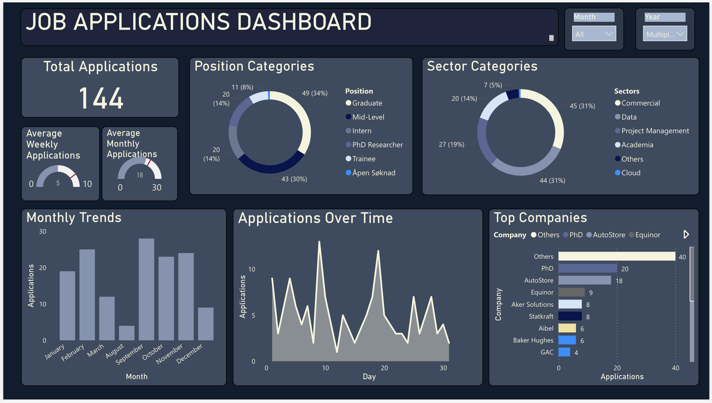

# Job Applications Analytics Dashboard

[](https://powerbi.microsoft.com/)
[](my_job_applications_clean.xlsx)

A comprehensive Power BI dashboard for analyzing job application data extracted from email confirmations of job applications, covering the period from August 1, 2023 to March 31, 2025.


## 📈 Application Metrics

- **Total Applications Submitted**: Track volume over time
- **Timeline Visualization**: View application activity across the 20-month period
- **Monthly/Weekly Trends**: Identify seasonal patterns in applications
- **Company Analysis**: Track number of applications per company 
- **Job Role and Sector Categorization**: Analyze applications by position type, level and sector


## 📋 Data Source

### Email Extraction Process

The dashboard is powered by data extracted from email communications mainly from email inbox from **Application Confirmations** which are automated responses from job application portals and company systems

### Data Period

- **Start Date**: August 1, 2023
- **End Date**: March 31, 2025
- **Total Duration**: 20 months


## 🛠️ Setup Instructions

### Prerequisites

- Power BI Desktop 
- Microsoft Excel or Power Query for data preprocessing
- Access to email data export (I used this [python script](job_extractor.py) to extract data from my yahoo mail)

### Installation Steps

1. **Clone the Repository**
   
   ```bash
   git clone https://github.com/l-teefah/Job%Applications.git
   cd Job%Applications
   ```

2. **Data Preparation**
   
   - Export email data for the specified date range
   - Run the data cleaning script 
   - Ensure data follows the expected schema (see Data Schema section)

3. **Power BI Setup**
   
   - Open [Job Applications Dashboard.pbix](Job%Applications.pbix) in Power BI Desktop
   - Update data source connections to point to your prepared dataset
   - Refresh the data model
     
4. **Customize for Your Data**
   
   - Update company names, job titles, and categories as needed
   - Adjust slicers date filters and ranges
   - Modify visualizations based on your specific requirements


## 📁 File Structure

```
Job Applications/
├── job_dashboard_readme.md
├── Job Applications.pbix
├── data/
│   ├── raw/
│   │   └── my_job_applications.xlsx/
│   ├── processed/
│   │   └── my_job_applications_clean.xlsx
├── scripts/
│   ├── job_extractor.py
└── screenshots/
    ├── Job_applications_dashboard_overview.png
```

## Calculated Metrics

### Calculated Columns

- **Week Number**

``` DAX
Week Number = WEEKNUM('Job Applications'[Date], 1)
```

- **Month & Year**

``` DAX
Month & Year = FORMAT('Job Applications'[Date], "YYYY-MM")
```


### Calculated DAX Metrics

- **Average Weekly Applications**

``` DAX
Average Weekly Applications =
VAR TotalApplications = COUNTROWS('Job Applications')
VAR TotalWeeks = DISTINCTCOUNT('Job Applications'[Week Number])
RETURN
DIVIDE(TotalApplications, TotalWeeks)
```
- **Average Monthly Applications**

``` DAX
Average Monthly Applications =
VAR TotalApplications = COUNTROWS('Job Applications')
VAR TotalMonths = DISTINCTCOUNT('Job Applications'[Month & Year])
RETURN
DIVIDE(TotalApplications, TotalMonths)
```

- **Weekly Target**

``` DAX
Weekly Target = 8
```

- **Maximum Target** (for weekly calculation)

``` DAX
Maximum Target = 10
```

- **Monthly Target**

``` DAX
Monthly Target = 30
```

- **Max Monthly Target**

``` DAX
Max Monthly Target = 30
```


## 🎨 Color Palette

The dashboard uses a carefully designed color palette optimized for dark themes and data visualization clarity.

### Primary Colors
| Color | Hex Code | Preview |
|-------|----------|---------|
| Deep Navy | `#1a1d29` | <span style="display:inline-block;width:20px;height:20px;background-color:#1a1d29;border:1px solid #ccc;"></span> |
| Card Background | `#2a2f3a` | <span style="display:inline-block;width:20px;height:20px;background-color:#2a2f3a;border:1px solid #ccc;"></span> |
| Surface | `#363b4a` | <span style="display:inline-block;width:20px;height:20px;background-color:#363b4a;border:1px solid #ccc;"></span> |
| Neutral Gray | `#4a5568` | <span style="display:inline-block;width:20px;height:20px;background-color:#4a5568;border:1px solid #ccc;"></span> |

### Data Visualization Colors
| Color | Hex Code | Preview |
|-------|----------|---------|
| Primary Blue | `#4fc3f7` | <span style="display:inline-block;width:20px;height:20px;background-color:#4fc3f7;border:1px solid #ccc;"></span> |
| Accent Blue | `#29b6f6` | <span style="display:inline-block;width:20px;height:20px;background-color:#29b6f6;border:1px solid #ccc;"></span> |
| Deep Blue | `#1976d2` | <span style="display:inline-block;width:20px;height:20px;background-color:#1976d2;border:1px solid #ccc;"></span> |
| Navy Blue | `#0d47a1` | <span style="display:inline-block;width:20px;height:20px;background-color:#0d47a1;border:1px solid #ccc;"></span> |

### Status & Supporting Colors
| Color | Hex Code | Preview |
|-------|----------|---------|
| Success Green | `#81c784`  | <span style="display:inline-block;width:20px;height:20px;background-color:#81c784;border:1px solid #ccc;"></span> |
| Warning Orange | `#ffb74d` | <span style="display:inline-block;width:20px;height:20px;background-color:#ffb74d;border:1px solid #ccc;"></span> |
| Alert Red | `#e57373` | <span style="display:inline-block;width:20px;height:20px;background-color:#e57373;border:1px solid #ccc;"></span> |
| Accent Purple | `#ba68c8` | <span style="display:inline-block;width:20px;height:20px;background-color:#ba68c8;border:1px solid #ccc;"></span> |

### Text Colors
| Color | Hex Code | Preview |
|-------|----------|---------|
| Primary Text | `#ffffff` | <span style="display:inline-block;width:20px;height:20px;background-color:#ffffff;border:1px solid #ccc;"></span> |
| Secondary Text | `#b0b7c3` | <span style="display:inline-block;width:20px;height:20px;background-color:#b0b7c3;border:1px solid #ccc;"></span> |
| Muted Text | `#78849e` | <span style="display:inline-block;width:20px;height:20px;background-color:#78849e;border:1px solid #ccc;"></span> |
| Subtle Text | `#526075`| <span style="display:inline-block;width:20px;height:20px;background-color:#526075;border:1px solid #ccc;"></span> |

### Power BI Implementation

**To apply this color palette in Power BI:**

1. **Custom Theme Method:**
   
   ```json
   {
     "name": "Job Applications Dashboard Theme",
     "dataColors": ["#4fc3f7", "#29b6f6", "#1976d2", "#0d47a1", "#81c784", "#ffb74d", "#e57373", "#ba68c8"],
     "background": "#1a1d29",
     "foreground": "#ffffff",
     "tableAccent": "#4fc3f7"
   }
   ```

2. **Manual Color Assignment:**
   
   - Navigate to Format > Visual > Colors
   - Apply hex codes from the palette above
   - Use blue scale progression for data series
   - Apply status colors for categorical data

3. **Best Practices:**
   
   - Use `#4fc3f7` → `#0d47a1` progression for primary data
   - Reserve green/orange/red for status indicators
   - Maintain contrast ratios of 4.5:1 minimum for accessibility

**Color Files:**

- Full interactive palette: [Color_Palette](color_palette.html)
- Power BI theme file: [Dashboard_Theme](dashboard_theme.json)


## 🔄 Data Refresh

### Automated Refresh (if using Power BI Service)

- Schedule: Daily/Weekly refresh
- Data source: Connected email system or updated CSV files

### Manual Refresh

1. Export new email data
2. Update the dataset
3. Refresh the Power BI model
4. Verify data integrity


## 📸 Screenshots




## 🤝 Contributing

Contributions are welcome! Please follow these steps:

1. Fork the repository
2. Create a feature branch (`git checkout -b feature/AmazingFeature`)
3. Commit your changes (`git commit -m 'Add some AmazingFeature'`)
4. Push to the branch (`git push origin feature/AmazingFeature`)
5. Open a Pull Request


## 📄 License

This project is licensed under the MIT License and open-sourced


## 🔗 Additional Resources

- [Power BI Documentation](https://docs.microsoft.com/en-us/power-bi/)


## 📞 Support & Contact

For questions, issues, or suggestions:
- Create an issue in this repository
- [Email] (lateefah_yusuf@yahoo.com)
- [LinkedIn] (https://www.linkedin.com/in/lateefahyusuf/)

---

**Note**: This dashboard contains my personal job search data. Confirm if all company names and your personal information are allowed to be shared before sharing publicly.

---
